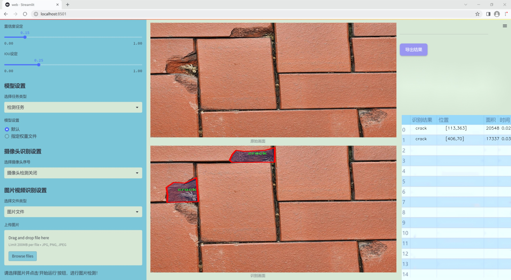
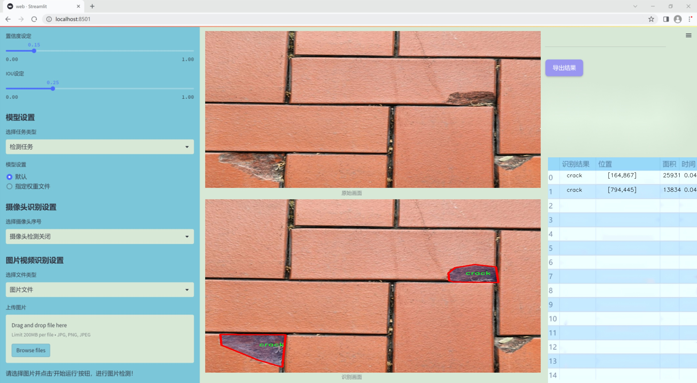
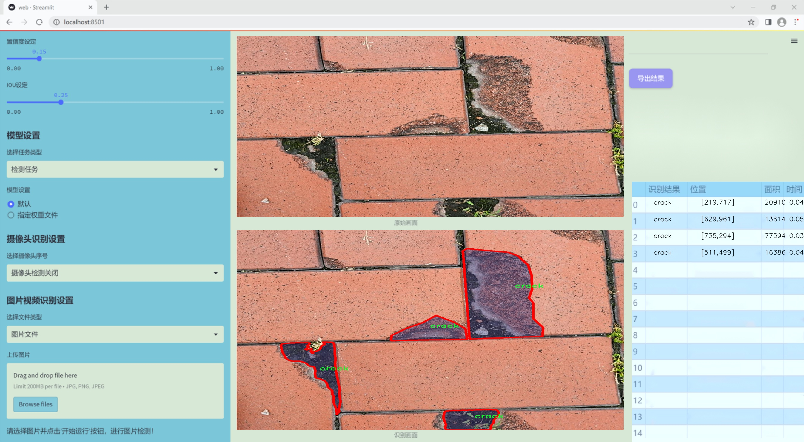
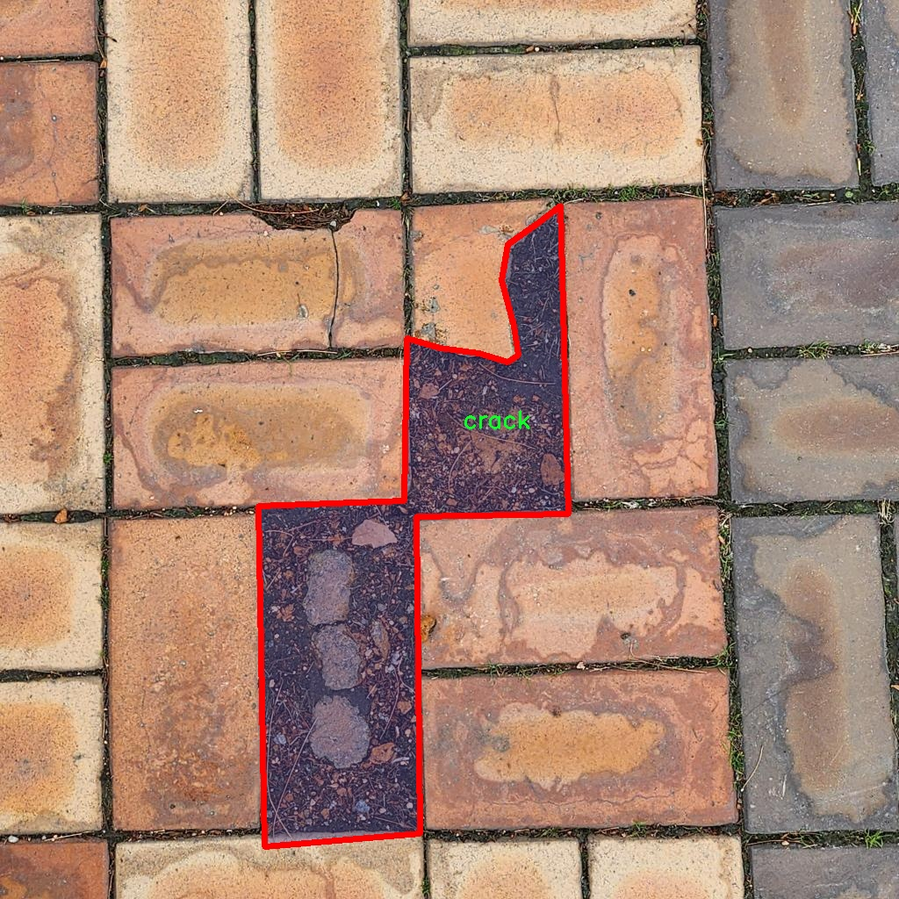
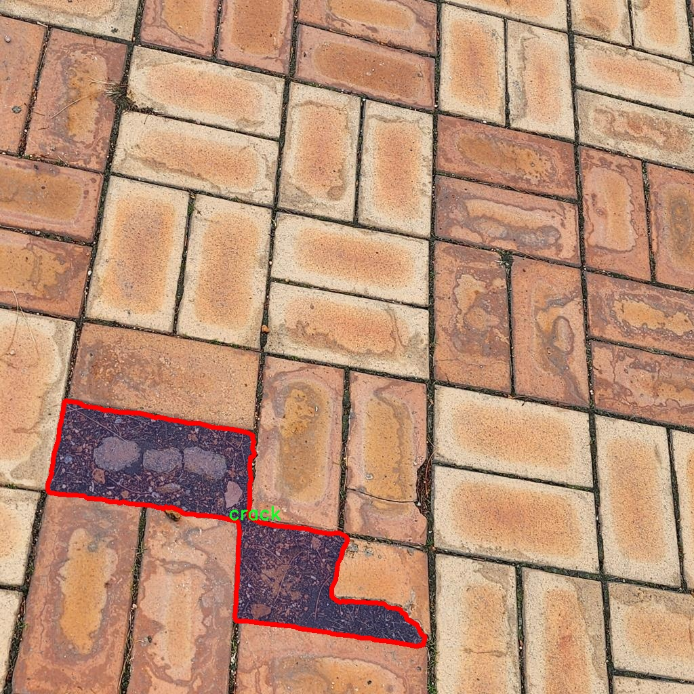
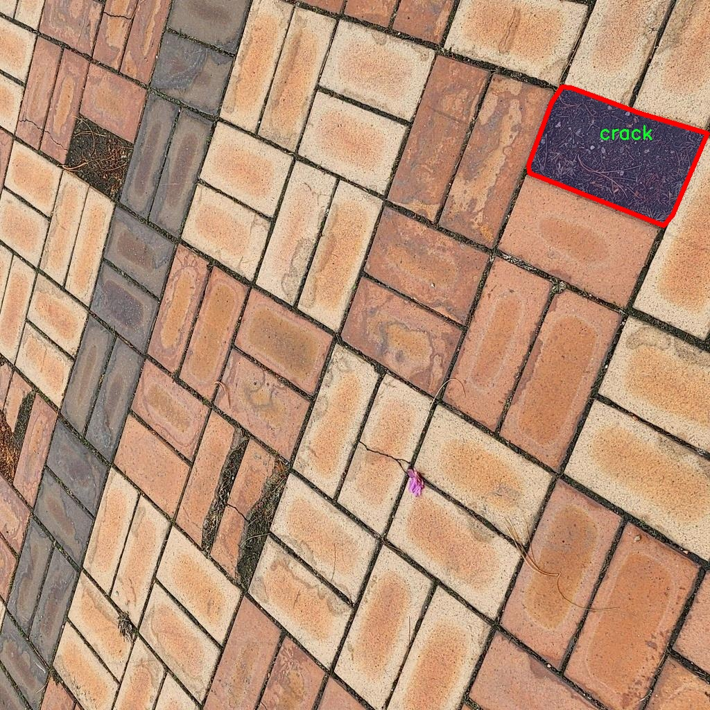
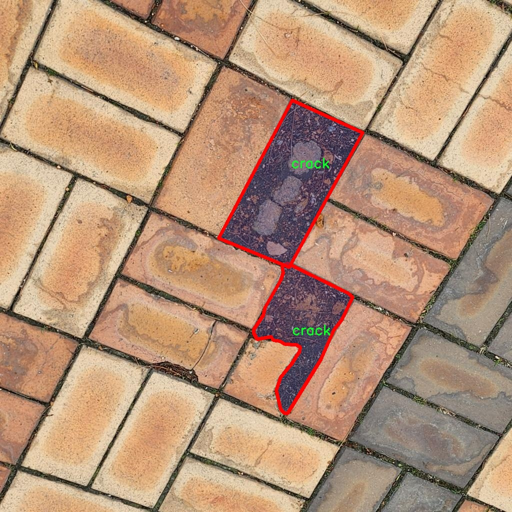
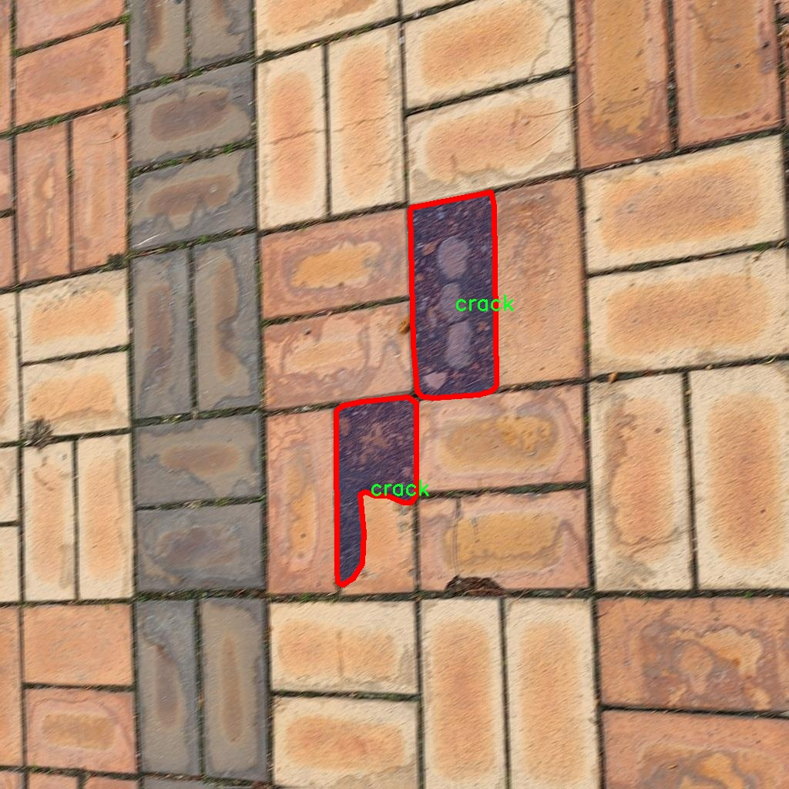

### 1.背景意义

研究背景与意义

随着城市化进程的加快，基础设施的建设和维护变得愈发重要。砖块作为常见的建筑材料，其在道路、墙体等结构中的应用广泛。然而，砖块在长期使用过程中容易出现裂缝，这不仅影响了建筑物的美观，更可能导致结构安全隐患。因此，及时、准确地检测和分割砖块裂缝，对于维护建筑物的安全性和延长其使用寿命具有重要意义。

传统的裂缝检测方法多依赖人工检查，效率低且容易受到主观因素的影响。随着计算机视觉技术的快速发展，基于深度学习的自动化检测方法逐渐成为研究热点。YOLO（You Only Look Once）系列模型因其高效的实时检测能力，广泛应用于目标检测任务中。YOLOv11作为该系列的最新版本，具备更强的特征提取能力和更高的检测精度，为裂缝检测提供了新的技术手段。

本研究旨在基于改进的YOLOv11模型，构建一个高效的砖块裂缝检测分割系统。通过使用包含1500张图像的裂缝分割数据集，模型将能够准确识别和分割砖块中的裂缝。该数据集专注于单一类别的裂缝，确保了模型训练的专一性和有效性。通过对数据集的预处理和模型的优化，期望能够显著提高裂缝检测的准确率和实时性。

本项目的研究不仅有助于推动计算机视觉技术在建筑工程领域的应用，还为未来的智能建筑维护提供了理论基础和实践参考。通过实现自动化的裂缝检测与分割，将有效降低人工成本，提高检测效率，最终实现对建筑物的智能化管理。

### 2.视频效果

[2.1 视频效果](https://www.bilibili.com/video/BV1wNqBYyEFt/)

### 3.图片效果







##### [项目涉及的源码数据来源链接](https://kdocs.cn/l/cszuIiCKVNis)**

注意：本项目提供训练的数据集和训练教程,由于版本持续更新,暂不提供权重文件（best.pt）,请按照6.训练教程进行训练后实现上图演示的效果。

### 4.数据集信息

##### 4.1 本项目数据集类别数＆类别名

nc: 1
names: ['crack']


该项目为【图像分割】数据集，请在【训练教程和Web端加载模型教程（第三步）】这一步的时候按照【图像分割】部分的教程来训练

##### 4.2 本项目数据集信息介绍

本项目数据集信息介绍

本项目所使用的数据集名为“crack segmentation_ver2”，专门用于训练和改进YOLOv11模型，以实现高效的砖块裂缝检测与分割。该数据集的设计旨在为裂缝检测提供丰富的样本，以便模型能够准确识别和分割砖块表面的裂缝特征。数据集中包含的类别数量为1，具体类别为“crack”，即裂缝。这一单一类别的选择反映了项目的专注性，旨在深入研究裂缝的特征及其在不同环境和条件下的表现。

数据集中的图像样本涵盖了多种类型的砖块裂缝，确保了训练过程中模型能够接触到多样化的裂缝形态和背景。这些样本不仅包括不同尺寸和形状的裂缝，还涵盖了在不同光照条件、不同材质和不同磨损程度下的砖块表面。通过这种多样化的样本，模型将能够学习到裂缝的多种表现形式，从而提高其在实际应用中的鲁棒性和准确性。

在数据集的标注过程中，采用了精确的分割标注技术，确保每个裂缝的边界都被准确地标识。这种高质量的标注对于训练深度学习模型至关重要，因为它直接影响到模型的学习效果和最终的检测性能。通过使用“crack segmentation_ver2”数据集，项目旨在推动砖块裂缝检测技术的发展，为建筑物的安全监测和维护提供更为有效的解决方案。最终目标是实现一个能够在实际应用中快速、准确地检测和分割裂缝的智能系统，为相关领域的研究和应用提供有力支持。











### 5.全套项目环境部署视频教程（零基础手把手教学）

[5.1 所需软件PyCharm和Anaconda安装教程（第一步）](https://www.bilibili.com/video/BV1BoC1YCEKi/?spm_id_from=333.999.0.0&vd_source=bc9aec86d164b67a7004b996143742dc)


[5.2 安装Python虚拟环境创建和依赖库安装视频教程（第二步）](https://www.bilibili.com/video/BV1ZoC1YCEBw?spm_id_from=333.788.videopod.sections&vd_source=bc9aec86d164b67a7004b996143742dc)

### 6.改进YOLOv11训练教程和Web_UI前端加载模型教程（零基础手把手教学）

[6.1 改进YOLOv11训练教程和Web_UI前端加载模型教程（第三步）](https://www.bilibili.com/video/BV1BoC1YCEhR?spm_id_from=333.788.videopod.sections&vd_source=bc9aec86d164b67a7004b996143742dc)


按照上面的训练视频教程链接加载项目提供的数据集，运行train.py即可开始训练



     Epoch   gpu_mem       box       obj       cls    labels  img_size
     1/200     20.8G   0.01576   0.01955  0.007536        22      1280: 100%|██████████| 849/849 [14:42<00:00,  1.04s/it]
               Class     Images     Labels          P          R     mAP@.5 mAP@.5:.95: 100%|██████████| 213/213 [01:14<00:00,  2.87it/s]
                 all       3395      17314      0.994      0.957      0.0957      0.0843

     Epoch   gpu_mem       box       obj       cls    labels  img_size
     2/200     20.8G   0.01578   0.01923  0.007006        22      1280: 100%|██████████| 849/849 [14:44<00:00,  1.04s/it]
               Class     Images     Labels          P          R     mAP@.5 mAP@.5:.95: 100%|██████████| 213/213 [01:12<00:00,  2.95it/s]
                 all       3395      17314      0.996      0.956      0.0957      0.0845

     Epoch   gpu_mem       box       obj       cls    labels  img_size
     3/200     20.8G   0.01561    0.0191  0.006895        27      1280: 100%|██████████| 849/849 [10:56<00:00,  1.29it/s]
               Class     Images     Labels          P          R     mAP@.5 mAP@.5:.95: 100%|███████   | 187/213 [00:52<00:00,  4.04it/s]
                 all       3395      17314      0.996      0.957      0.0957      0.0845


###### [项目数据集下载链接](https://kdocs.cn/l/cszuIiCKVNis)

### 7.原始YOLOv11算法讲解


##### YOLO11介绍

Ultralytics YOLO11是一款尖端的、最先进的模型，它在之前YOLO版本成功的基础上进行了构建，并引入了新功能和改进，以进一步提升性能和灵活性。
**YOLO11设计快速、准确且易于使用，使其成为各种物体检测和跟踪、实例分割、图像分类以及姿态估计任务的绝佳选择。**


**结构图如下：**


##### **C3k2**

**C3k2，结构图如下**


**C3k2，继承自类`C2f，其中通过c3k设置False或者Ture来决定选择使用C3k还是`**Bottleneck


**实现代码** **ultralytics/nn/modules/block.py**

##### C2PSA介绍

**借鉴V10 PSA结构，实现了C2PSA和C2fPSA，最终选择了基于C2的C2PSA（可能涨点更好？）**


**实现代码** **ultralytics/nn/modules/block.py**

##### Detect介绍

**分类检测头引入了DWConv（更加轻量级，为后续二次创新提供了改进点），结构图如下（和V8的区别）：**


### 8.200+种全套改进YOLOV11创新点原理讲解

#### 8.1 200+种全套改进YOLOV11创新点原理讲解大全

由于篇幅限制，每个创新点的具体原理讲解就不全部展开，具体见下列网址中的改进模块对应项目的技术原理博客网址【Blog】（创新点均为模块化搭建，原理适配YOLOv5~YOLOv11等各种版本）

[改进模块技术原理博客【Blog】网址链接](https://gitee.com/qunmasj/good)


#### 8.2 精选部分改进YOLOV11创新点原理讲解

###### 这里节选部分改进创新点展开原理讲解(完整的改进原理见上图和[改进模块技术原理博客链接](https://gitee.com/qunmasj/good)【如果此小节的图加载失败可以通过CSDN或者Github搜索该博客的标题访问原始博客，原始博客图片显示正常】

### RT-DETR骨干网络HGNetv2简介
#### RT-DETR横空出世
前几天被百度的RT-DETR刷屏，参考该博客提出的目标检测新范式对原始DETR的网络结构进行了调整和优化，以提高计算速度和减小模型大小。这包括使用更轻量级的基础网络和调整Transformer结构。并且，摒弃了nms处理的detr结构与传统的物体检测方法相比，不仅训练是端到端的，检测也能端到端，这意味着整个网络在训练过程中一起进行优化，推理过程不需要昂贵的后处理代价，这有助于提高模型的泛化能力和性能。


当然，人们对RT-DETR之所以产生浓厚的兴趣，我觉得大概率还是对YOLO系列审美疲劳了，就算是出到了YOLO10086，我还是只想用YOLOv11和YOLOv11的框架来魔改做业务。。

#### 初识HGNet
看到RT-DETR的性能指标，发现指标最好的两个模型backbone都是用的HGNetv2，毫无疑问，和当时的picodet一样，骨干都是使用百度自家的网络。初识HGNet的时候，当时是参加了第四届百度网盘图像处理大赛，文档图像方向识别专题赛道，简单来说，就是使用分类网络对一些文档截图或者图片进行方向角度分类。


当时的方案并没有那么快定型，通常是打榜过程发现哪个网络性能好就使用哪个网络做魔改，而且木有显卡，只能蹭Ai Studio的平台，不过v100一天8小时的实验时间有点短，这也注定了大模型用不了。 

流水的模型，铁打的炼丹人，最后发现HGNet-tiny各方面指标都很符合我们的预期，后面就一直围绕它魔改。当然，比赛打榜是目的，学习才是享受过程，当时看到效果还可以，便开始折腾起了HGNet的网络架构，我们可以看到，PP-HGNet 针对 GPU 设备，对目前 GPU 友好的网络做了分析和归纳，尽可能多的使用 3x3 标准卷积（计算密度最高），PP-HGNet是由多个HG-Block组成，细节如下：


ConvBNAct是啥？简单聊一聊，就是Conv+BN+Act，CV Man应该最熟悉不过了：
```python
class ConvBNAct(TheseusLayer):
    def __init__(self,
                 in_channels,
                 out_channels,
                 kernel_size,
                 stride,
                 groups=1,
                 use_act=True):
        super().__init__()
        self.use_act = use_act
        self.conv = Conv2D(
            in_channels,
            out_channels,
            kernel_size,
            stride,
            padding=(kernel_size - 1) // 2,
            groups=groups,
            bias_attr=False)
        self.bn = BatchNorm2D(
            out_channels,
            weight_attr=ParamAttr(regularizer=L2Decay(0.0)),
            bias_attr=ParamAttr(regularizer=L2Decay(0.0)))
        if self.use_act:
            self.act = ReLU()
 
    def forward(self, x):
        x = self.conv(x)
        x = self.bn(x)
        if self.use_act:
            x = self.act(x)
        return x 
```
且标准卷积的数量随层数深度增加而增多，从而得到一个有利于 GPU 推理的骨干网络，同样速度下，精度也超越其他 CNN ，性价比也优于ViT-base模型。


另外，我们可以看到：

PP-HGNet 的第一层由channel为96的Stem模块构成，目的是为了减少参数量和计算量。PP-HGNet

Tiny的整体结构由四个HG Stage构成，而每个HG Stage主要由包含大量标准卷积的HG Block构成。

PP-HGNet的第三到第五层使用了使用了可学习的下采样层（LDS Layer），该层group为输入通道数，可达到降参降计算量的作用，且Tiny模型仅包含三个LDS Layer，并不会对GPU的利用率造成较大影响.

PP-HGNet的激活函数为Relu，常数级操作可保证该模型在硬件上的推理速度。

### 9.系统功能展示

图9.1.系统支持检测结果表格显示

  图9.2.系统支持置信度和IOU阈值手动调节

  图9.3.系统支持自定义加载权重文件best.pt(需要你通过步骤5中训练获得)

  图9.4.系统支持摄像头实时识别

  图9.5.系统支持图片识别

  图9.6.系统支持视频识别

  图9.7.系统支持识别结果文件自动保存

  图9.8.系统支持Excel导出检测结果数据


### 10. YOLOv11核心改进源码讲解

#### 10.1 repvit.py

以下是经过简化和注释的核心代码部分，保留了模型的主要结构和功能，同时添加了详细的中文注释。

```python
import torch
import torch.nn as nn
from timm.models.layers import SqueezeExcite

def _make_divisible(v, divisor, min_value=None):
    """
    确保所有层的通道数是8的倍数
    :param v: 输入的通道数
    :param divisor: 除数
    :param min_value: 最小值
    :return: 处理后的通道数
    """
    if min_value is None:
        min_value = divisor
    new_v = max(min_value, int(v + divisor / 2) // divisor * divisor)
    if new_v < 0.9 * v:
        new_v += divisor
    return new_v

class Conv2d_BN(nn.Sequential):
    """
    包含卷积层和批归一化层的组合
    """
    def __init__(self, in_channels, out_channels, kernel_size=1, stride=1, padding=0, dilation=1, groups=1):
        super().__init__()
        # 添加卷积层
        self.add_module('conv', nn.Conv2d(in_channels, out_channels, kernel_size, stride, padding, dilation, groups, bias=False))
        # 添加批归一化层
        self.add_module('bn', nn.BatchNorm2d(out_channels))

    @torch.no_grad()
    def fuse_self(self):
        """
        融合卷积层和批归一化层为单一卷积层
        """
        conv, bn = self._modules.values()
        # 计算融合后的权重和偏置
        w = bn.weight / (bn.running_var + bn.eps)**0.5
        w = conv.weight * w[:, None, None, None]
        b = bn.bias - bn.running_mean * bn.weight / (bn.running_var + bn.eps)**0.5
        # 创建新的卷积层
        fused_conv = nn.Conv2d(w.size(1) * conv.groups, w.size(0), w.shape[2:], stride=conv.stride, padding=conv.padding, dilation=conv.dilation, groups=conv.groups)
        fused_conv.weight.data.copy_(w)
        fused_conv.bias.data.copy_(b)
        return fused_conv

class Residual(nn.Module):
    """
    残差连接模块
    """
    def __init__(self, module, drop=0.):
        super().__init__()
        self.module = module  # 传入的模块
        self.drop = drop  # 随机丢弃率

    def forward(self, x):
        # 计算残差
        if self.training and self.drop > 0:
            return x + self.module(x) * torch.rand(x.size(0), 1, 1, 1, device=x.device).ge_(self.drop).div(1 - self.drop).detach()
        else:
            return x + self.module(x)

class RepViTBlock(nn.Module):
    """
    RepViT模块，包含通道混合和token混合
    """
    def __init__(self, inp, hidden_dim, oup, kernel_size, stride, use_se, use_hs):
        super(RepViTBlock, self).__init__()
        self.identity = stride == 1 and inp == oup  # 判断是否为身份连接
        assert(hidden_dim == 2 * inp)  # 确保隐藏层维度是输入的两倍

        if stride == 2:
            # 下采样时的token混合
            self.token_mixer = nn.Sequential(
                Conv2d_BN(inp, inp, kernel_size, stride, (kernel_size - 1) // 2, groups=inp),
                SqueezeExcite(inp, 0.25) if use_se else nn.Identity(),
                Conv2d_BN(inp, oup, ks=1, stride=1, pad=0)
            )
            # 通道混合
            self.channel_mixer = Residual(nn.Sequential(
                Conv2d_BN(oup, 2 * oup, 1, 1, 0),
                nn.GELU() if use_hs else nn.GELU(),
                Conv2d_BN(2 * oup, oup, 1, 1, 0)
            ))
        else:
            assert(self.identity)
            # 身份连接的token混合
            self.token_mixer = nn.Sequential(
                Conv2d_BN(inp, inp, 3, 1, 1, groups=inp),
                SqueezeExcite(inp, 0.25) if use_se else nn.Identity(),
            )
            # 通道混合
            self.channel_mixer = Residual(nn.Sequential(
                Conv2d_BN(inp, hidden_dim, 1, 1, 0),
                nn.GELU() if use_hs else nn.GELU(),
                Conv2d_BN(hidden_dim, oup, 1, 1, 0)
            ))

    def forward(self, x):
        return self.channel_mixer(self.token_mixer(x))

class RepViT(nn.Module):
    """
    RepViT模型
    """
    def __init__(self, cfgs):
        super(RepViT, self).__init__()
        self.cfgs = cfgs  # 配置参数
        input_channel = self.cfgs[0][2]  # 输入通道数
        # 构建初始层
        patch_embed = nn.Sequential(Conv2d_BN(3, input_channel // 2, 3, 2, 1), nn.GELU(),
                                     Conv2d_BN(input_channel // 2, input_channel, 3, 2, 1))
        layers = [patch_embed]
        # 构建RepViT块
        for k, t, c, use_se, use_hs, s in self.cfgs:
            output_channel = _make_divisible(c, 8)
            exp_size = _make_divisible(input_channel * t, 8)
            layers.append(RepViTBlock(input_channel, exp_size, output_channel, k, s, use_se, use_hs))
            input_channel = output_channel
        self.features = nn.ModuleList(layers)

    def forward(self, x):
        features = []
        for f in self.features:
            x = f(x)
            features.append(x)
        return features

def repvit_m2_3(weights=''):
    """
    构建RepViT模型
    """
    cfgs = [
        # k, t, c, SE, HS, s 
        [3, 2, 80, 1, 0, 1],
        [3, 2, 80, 0, 0, 1],
        # 省略其他配置...
        [3, 2, 640, 1, 1, 1]
    ]
    model = RepViT(cfgs)
    if weights:
        model.load_state_dict(torch.load(weights)['model'])
    return model

if __name__ == '__main__':
    model = repvit_m2_3('repvit_m2_3_distill_450e.pth')
    inputs = torch.randn((1, 3, 640, 640))
    res = model(inputs)
    for i in res:
        print(i.size())
```

### 代码说明：
1. **_make_divisible**: 确保通道数是8的倍数，以便于后续的操作。
2. **Conv2d_BN**: 定义了一个包含卷积层和批归一化层的组合，支持融合操作。
3. **Residual**: 实现了残差连接，支持随机丢弃。
4. **RepViTBlock**: 定义了RepViT的基本模块，包含token混合和通道混合的功能。
5. **RepViT**: 主要模型类，构建整个网络结构。
6. **repvit_m2_3**: 构建特定配置的RepViT模型，并加载权重。

此代码片段是模型的核心部分，去除了冗余的代码和注释，保留了主要功能和结构。

这个文件`repvit.py`实现了一个基于RepVGG架构的视觉模型，主要用于图像分类等任务。代码中包含了多个类和函数，用于构建和管理模型的各个部分。

首先，文件导入了必要的库，包括PyTorch的神经网络模块、NumPy以及一些用于构建模型的辅助层。接着，定义了一个`replace_batchnorm`函数，用于替换模型中的BatchNorm层为Identity层，以便在推理时加速计算。

接下来，定义了一个`_make_divisible`函数，确保模型的每一层的通道数都是8的倍数，这在某些情况下有助于提高模型的性能。

`Conv2d_BN`类是一个自定义的卷积层，包含卷积操作和BatchNorm层，并在初始化时对BatchNorm的权重进行了初始化。它还实现了一个`fuse_self`方法，用于将卷积和BatchNorm层融合为一个卷积层，以减少计算量。

`Residual`类实现了残差连接，允许在训练时随机丢弃部分输入，以增强模型的鲁棒性。它同样实现了`fuse_self`方法，用于融合残差连接中的卷积层。

`RepVGGDW`类实现了一个特定的卷积块，包含深度可分离卷积和残差连接。它的前向传播方法将输入通过卷积和BatchNorm层进行处理，并加上输入本身。

`RepViTBlock`类是RepViT模型的基本构建块，负责处理输入的特征图。它根据步幅的不同选择不同的结构，包括通道混合和令牌混合的操作。

`RepViT`类是整个模型的核心，负责构建网络的各个层次。它根据传入的配置构建多个`RepViTBlock`，并在前向传播时提取特征。

`switch_to_deploy`方法用于在推理阶段替换BatchNorm层，以提高推理速度。

`update_weight`函数用于更新模型的权重，将预训练模型的权重加载到当前模型中。

最后，定义了一系列的模型构造函数，如`repvit_m0_9`、`repvit_m1_0`等，这些函数根据不同的配置构建相应的RepViT模型，并可以选择加载预训练权重。

在`__main__`部分，代码实例化了一个RepViT模型，并对一个随机生成的输入进行前向传播，输出各层的特征图大小。这部分代码用于测试模型的构建和前向传播是否正常。

#### 10.2 deconv.py

以下是代码中最核心的部分，并附上详细的中文注释：

```python
import math
import torch
from torch import nn
from einops.layers.torch import Rearrange

# 定义一个自定义的二维卷积层，具有不同的权重处理方式
class Conv2d_cd(nn.Module):
    def __init__(self, in_channels, out_channels, kernel_size=3, stride=1,
                 padding=1, dilation=1, groups=1, bias=False, theta=1.0):
        super(Conv2d_cd, self).__init__() 
        # 初始化标准的卷积层
        self.conv = nn.Conv2d(in_channels, out_channels, kernel_size=kernel_size, stride=stride, padding=padding, dilation=dilation, groups=groups, bias=bias)
        self.theta = theta  # 额外参数，用于权重调整

    def get_weight(self):
        # 获取卷积层的权重
        conv_weight = self.conv.weight
        conv_shape = conv_weight.shape  # 权重的形状
        # 将权重重排为(c_in, c_out, k1*k2)的形状
        conv_weight = Rearrange('c_in c_out k1 k2 -> c_in c_out (k1 k2)')(conv_weight)
        
        # 创建一个新的权重张量，初始化为0
        conv_weight_cd = torch.zeros(conv_shape[0], conv_shape[1], 3 * 3, device=conv_weight.device, dtype=conv_weight.dtype)
        # 将原始权重复制到新的权重张量中
        conv_weight_cd[:, :, :] = conv_weight[:, :, :]
        # 调整权重，使得某个位置的值等于原始权重的和
        conv_weight_cd[:, :, 4] = conv_weight[:, :, 4] - conv_weight[:, :, :].sum(2)
        # 重排回原来的形状
        conv_weight_cd = Rearrange('c_in c_out (k1 k2) -> c_in c_out k1 k2', k1=conv_shape[2], k2=conv_shape[3])(conv_weight_cd)
        return conv_weight_cd, self.conv.bias  # 返回调整后的权重和偏置


class DEConv(nn.Module):
    def __init__(self, dim):
        super(DEConv, self).__init__()
        # 初始化多个自定义卷积层
        self.conv1_1 = Conv2d_cd(dim, dim, 3, bias=True)
        self.conv1_2 = Conv2d_cd(dim, dim, 3, bias=True)  # 使用相同的卷积类，实际可以根据需要更改
        self.conv1_3 = Conv2d_cd(dim, dim, 3, bias=True)
        self.conv1_4 = Conv2d_cd(dim, dim, 3, bias=True)
        self.conv1_5 = nn.Conv2d(dim, dim, 3, padding=1, bias=True)  # 最后一个标准卷积层
        
        self.bn = nn.BatchNorm2d(dim)  # 批归一化层
        self.act = nn.ReLU()  # 激活函数

    def forward(self, x):
        # 前向传播，计算输出
        w1, b1 = self.conv1_1.get_weight()
        w2, b2 = self.conv1_2.get_weight()
        w3, b3 = self.conv1_3.get_weight()
        w4, b4 = self.conv1_4.get_weight()
        w5, b5 = self.conv1_5.weight, self.conv1_5.bias

        # 将所有卷积层的权重和偏置相加
        w = w1 + w2 + w3 + w4 + w5
        b = b1 + b2 + b3 + b4 + b5
        # 使用合并后的权重和偏置进行卷积操作
        res = nn.functional.conv2d(input=x, weight=w, bias=b, stride=1, padding=1, groups=1)
        
        # 应用批归一化和激活函数
        res = self.bn(res)
        return self.act(res)

    def switch_to_deploy(self):
        # 切换到部署模式，合并权重和偏置
        w1, b1 = self.conv1_1.get_weight()
        w2, b2 = self.conv1_2.get_weight()
        w3, b3 = self.conv1_3.get_weight()
        w4, b4 = self.conv1_4.get_weight()
        w5, b5 = self.conv1_5.weight, self.conv1_5.bias

        # 合并权重和偏置
        self.conv1_5.weight = torch.nn.Parameter(w1 + w2 + w3 + w4 + w5)
        self.conv1_5.bias = torch.nn.Parameter(b1 + b2 + b3 + b4 + b5)
        
        # 删除不再需要的卷积层
        del self.conv1_1
        del self.conv1_2
        del self.conv1_3
        del self.conv1_4
```

### 代码说明：
1. **卷积层类（Conv2d_cd）**：自定义的卷积层，重写了权重获取方式，支持权重的特殊处理。
2. **DEConv类**：组合多个卷积层，并在前向传播中将它们的权重和偏置合并。`switch_to_deploy`方法用于在推理时合并权重以提高效率。
3. **前向传播**：通过合并多个卷积层的权重和偏置，进行一次卷积操作，并应用批归一化和激活函数。

这个程序文件 `deconv.py` 定义了一些卷积层的变体，主要用于深度学习中的卷积神经网络（CNN）。文件中包含多个类，每个类实现了不同类型的卷积操作，具体包括 `Conv2d_cd`、`Conv2d_ad`、`Conv2d_rd`、`Conv2d_hd`、`Conv2d_vd` 和 `DEConv`。以下是对这些类及其功能的详细说明。

首先，`Conv2d_cd` 类实现了一种卷积层，提供了一个 `get_weight` 方法来获取卷积权重，并对权重进行处理，确保其符合特定的格式。这个类的主要目的是通过重排权重来创建一个新的权重矩阵，并对某些权重进行调整。

接下来，`Conv2d_ad` 类也是一种卷积层，类似于 `Conv2d_cd`，但在 `get_weight` 方法中，它对权重进行了不同的变换，使用了一个参数 `theta` 来调整权重。这种方式可能用于实现某种自适应卷积操作。

`Conv2d_rd` 类实现了一个具有不同处理逻辑的卷积层。在其 `forward` 方法中，如果 `theta` 的值接近于零，则直接使用标准卷积；否则，构造一个新的权重矩阵并进行卷积操作。这种设计允许在不同情况下选择不同的卷积方式。

`Conv2d_hd` 和 `Conv2d_vd` 类分别实现了针对一维卷积的变体，并在 `get_weight` 方法中对权重进行了特定的处理。这些类可能用于处理一维信号或特征。

最后，`DEConv` 类是一个组合卷积层，包含了前面定义的多个卷积层。它在 `forward` 方法中将这些卷积层的权重和偏置相加，然后进行一次卷积操作。`switch_to_deploy` 方法用于在模型部署时合并所有卷积层的权重和偏置，以提高推理效率。

在文件的最后部分，提供了一个简单的测试代码，创建了一个随机输入数据，并通过 `DEConv` 模型进行前向传播，最后比较了在切换到部署模式前后的输出是否一致。这种设计确保了模型在训练和推理阶段的输出一致性。

整体来看，这个文件实现了一些复杂的卷积操作，旨在提高卷积神经网络的灵活性和性能，特别是在处理不同类型的输入数据时。

#### 10.3 hcfnet.py

以下是代码中最核心的部分，并附上详细的中文注释：

```python
import torch
import torch.nn as nn
import torch.nn.functional as F

class SpatialAttentionModule(nn.Module):
    def __init__(self):
        super(SpatialAttentionModule, self).__init__()
        # 定义一个卷积层，用于生成空间注意力图
        self.conv2d = nn.Conv2d(in_channels=2, out_channels=1, kernel_size=7, stride=1, padding=3)
        self.sigmoid = nn.Sigmoid()  # 使用Sigmoid激活函数将输出归一化到[0, 1]

    def forward(self, x):
        # 计算输入特征图的平均值和最大值
        avgout = torch.mean(x, dim=1, keepdim=True)  # 在通道维度上计算平均值
        maxout, _ = torch.max(x, dim=1, keepdim=True)  # 在通道维度上计算最大值
        out = torch.cat([avgout, maxout], dim=1)  # 将平均值和最大值拼接在一起
        out = self.sigmoid(self.conv2d(out))  # 通过卷积层和Sigmoid激活函数生成注意力图
        return out * x  # 将注意力图与输入特征图相乘，进行加权

class LocalGlobalAttention(nn.Module):
    def __init__(self, output_dim, patch_size):
        super().__init__()
        self.output_dim = output_dim
        self.patch_size = patch_size
        # 定义两个全连接层和一个卷积层
        self.mlp1 = nn.Linear(patch_size * patch_size, output_dim // 2)
        self.norm = nn.LayerNorm(output_dim // 2)
        self.mlp2 = nn.Linear(output_dim // 2, output_dim)
        self.conv = nn.Conv2d(output_dim, output_dim, kernel_size=1)
        # 定义可学习的参数
        self.prompt = torch.nn.parameter.Parameter(torch.randn(output_dim, requires_grad=True)) 
        self.top_down_transform = torch.nn.parameter.Parameter(torch.eye(output_dim), requires_grad=True)

    def forward(self, x):
        x = x.permute(0, 2, 3, 1)  # 调整维度顺序，方便处理
        B, H, W, C = x.shape  # 获取批量大小、高度、宽度和通道数
        P = self.patch_size

        # 处理局部特征
        local_patches = x.unfold(1, P, P).unfold(2, P, P)  # 获取局部patches
        local_patches = local_patches.reshape(B, -1, P * P, C)  # 重新调整形状
        local_patches = local_patches.mean(dim=-1)  # 计算每个patch的平均值

        # 通过MLP处理局部特征
        local_patches = self.mlp1(local_patches)  # 第一层MLP
        local_patches = self.norm(local_patches)  # 归一化
        local_patches = self.mlp2(local_patches)  # 第二层MLP

        local_attention = F.softmax(local_patches, dim=-1)  # 计算局部注意力
        local_out = local_patches * local_attention  # 加权局部特征

        # 计算与prompt的余弦相似度
        cos_sim = F.normalize(local_out, dim=-1) @ F.normalize(self.prompt[None, ..., None], dim=1)  # 计算余弦相似度
        mask = cos_sim.clamp(0, 1)  # 限制在[0, 1]范围内
        local_out = local_out * mask  # 应用mask
        local_out = local_out @ self.top_down_transform  # 应用变换

        # 恢复形状并进行上采样
        local_out = local_out.reshape(B, H // P, W // P, self.output_dim)  # 恢复形状
        local_out = local_out.permute(0, 3, 1, 2)  # 调整维度顺序
        local_out = F.interpolate(local_out, size=(H, W), mode='bilinear', align_corners=False)  # 上采样
        output = self.conv(local_out)  # 通过卷积层生成输出

        return output

class PPA(nn.Module):
    def __init__(self, in_features, filters) -> None:
        super().__init__()
        # 定义各个卷积层和注意力模块
        self.skip = nn.Conv2d(in_features, filters, kernel_size=1, stride=1)  # 跳跃连接
        self.c1 = nn.Conv2d(filters, filters, kernel_size=3, padding=1)
        self.c2 = nn.Conv2d(filters, filters, kernel_size=3, padding=1)
        self.c3 = nn.Conv2d(filters, filters, kernel_size=3, padding=1)
        self.sa = SpatialAttentionModule()  # 空间注意力模块
        self.lga2 = LocalGlobalAttention(filters, 2)  # 局部全局注意力模块
        self.lga4 = LocalGlobalAttention(filters, 4)  # 局部全局注意力模块
        self.bn1 = nn.BatchNorm2d(filters)  # 批归一化
        self.silu = nn.SiLU()  # SiLU激活函数

    def forward(self, x):
        # 通过各个层进行前向传播
        x_skip = self.skip(x)  # 跳跃连接
        x_lga2 = self.lga2(x_skip)  # 局部全局注意力
        x_lga4 = self.lga4(x_skip)  # 局部全局注意力
        x1 = self.c1(x)  # 第一层卷积
        x2 = self.c2(x1)  # 第二层卷积
        x3 = self.c3(x2)  # 第三层卷积
        # 将各个特征图相加
        x = x1 + x2 + x3 + x_skip + x_lga2 + x_lga4
        x = self.sa(x)  # 应用空间注意力
        x = self.bn1(x)  # 批归一化
        x = self.silu(x)  # 激活
        return x  # 返回最终输出
```

以上代码包含了空间注意力模块、局部全局注意力模块和PPA模块的核心实现。每个模块的功能和结构都有详细的中文注释，便于理解其工作原理。

这个程序文件 `hcfnet.py` 定义了一些用于深度学习的神经网络模块，主要包括空间注意力模块、局部全局注意力模块、ECA（有效通道注意力）、PPA（部分特征提取模块）和 DASI（双重注意力模块）。以下是对各个部分的详细说明。

首先，`SpatialAttentionModule` 类实现了一个空间注意力机制。它通过对输入特征图进行平均池化和最大池化操作，生成两个特征图，然后将这两个特征图拼接在一起，经过一个卷积层和 Sigmoid 激活函数，最终生成一个注意力权重图。这个权重图与输入特征图相乘，从而强调了重要的空间区域。

接下来，`LocalGlobalAttention` 类实现了局部和全局注意力机制。它首先将输入特征图进行分块处理，提取局部特征。然后通过两个全连接层和层归一化对局部特征进行处理，生成局部注意力。局部特征经过归一化后与一个可学习的提示向量进行余弦相似度计算，生成一个掩码。最后，局部特征与掩码相乘，并通过一个变换矩阵进行处理，恢复特征图的形状，并使用双线性插值上采样到原始尺寸。

`ECA` 类实现了一种有效的通道注意力机制。它通过自适应平均池化将输入特征图压缩为一个通道向量，然后使用一维卷积生成通道注意力权重。该权重与输入特征图相乘，以增强重要通道的特征。

`PPA` 类是一个特征提取模块，包含多个卷积层和注意力机制。它首先通过跳跃连接提取特征，然后将这些特征通过局部全局注意力模块和卷积层进行处理，最后通过空间注意力模块进一步调整特征图。模块的输出经过批归一化和激活函数处理，以增强特征的表达能力。

`Bag` 类实现了一种简单的加权机制，用于结合不同特征图的输出。它通过计算边缘注意力来决定如何加权输入特征图和部分特征图的组合。

最后，`DASI` 类是一个双重注意力模块，结合了低级特征和高级特征。它通过跳跃连接提取不同层次的特征，并通过 `Bag` 类结合这些特征。该模块还包含卷积层和批归一化层，最终输出经过激活函数处理的特征图。

整体来看，这个文件实现了一些复杂的注意力机制和特征提取模块，旨在提高深度学习模型在图像处理任务中的性能。

#### 10.4 attention.py

以下是经过简化和注释的核心代码部分，主要保留了 `EMA`、`SimAM`、`SpatialGroupEnhance`、`TopkRouting`、`KVGather`、`QKVLinear` 和 `BiLevelRoutingAttention` 类。这些类实现了不同的注意力机制和特征增强模块，适用于深度学习模型中的特征处理。

```python
import torch
from torch import nn

class EMA(nn.Module):
    """ 
    Exponential Moving Average (EMA) module for feature enhancement.
    """
    def __init__(self, channels, factor=8):
        super(EMA, self).__init__()
        self.groups = factor  # 分组数
        assert channels // self.groups > 0  # 确保每组至少有一个通道
        self.softmax = nn.Softmax(-1)  # Softmax激活函数
        self.agp = nn.AdaptiveAvgPool2d((1, 1))  # 自适应平均池化
        self.pool_h = nn.AdaptiveAvgPool2d((None, 1))  # 自适应池化，保持高度
        self.pool_w = nn.AdaptiveAvgPool2d((1, None))  # 自适应池化，保持宽度
        self.gn = nn.GroupNorm(channels // self.groups, channels // self.groups)  # 分组归一化
        self.conv1x1 = nn.Conv2d(channels // self.groups, channels // self.groups, kernel_size=1)  # 1x1卷积
        self.conv3x3 = nn.Conv2d(channels // self.groups, channels // self.groups, kernel_size=3, padding=1)  # 3x3卷积

    def forward(self, x):
        b, c, h, w = x.size()  # 获取输入的尺寸
        group_x = x.reshape(b * self.groups, -1, h, w)  # 重新调整为分组形式
        x_h = self.pool_h(group_x)  # 对每组进行高度池化
        x_w = self.pool_w(group_x).permute(0, 1, 3, 2)  # 对每组进行宽度池化并转置
        hw = self.conv1x1(torch.cat([x_h, x_w], dim=2))  # 1x1卷积处理
        x_h, x_w = torch.split(hw, [h, w], dim=2)  # 分割为高度和宽度部分
        x1 = self.gn(group_x * x_h.sigmoid() * x_w.permute(0, 1, 3, 2).sigmoid())  # 归一化处理
        x2 = self.conv3x3(group_x)  # 3x3卷积处理
        # 计算权重
        x11 = self.softmax(self.agp(x1).reshape(b * self.groups, -1, 1).permute(0, 2, 1))
        x12 = x2.reshape(b * self.groups, c // self.groups, -1)  # 重新调整形状
        x21 = self.softmax(self.agp(x2).reshape(b * self.groups, -1, 1).permute(0, 2, 1))
        x22 = x1.reshape(b * self.groups, c // self.groups, -1)  # 重新调整形状
        weights = (torch.matmul(x11, x12) + torch.matmul(x21, x22)).reshape(b * self.groups, 1, h, w)  # 计算权重
        return (group_x * weights.sigmoid()).reshape(b, c, h, w)  # 返回加权后的特征

class SimAM(nn.Module):
    """ 
    Similarity Attention Module (SimAM) for enhancing feature representation.
    """
    def __init__(self, e_lambda=1e-4):
        super(SimAM, self).__init__()
        self.activaton = nn.Sigmoid()  # Sigmoid激活函数
        self.e_lambda = e_lambda  # 正则化参数

    def forward(self, x):
        b, c, h, w = x.size()  # 获取输入的尺寸
        n = w * h - 1  # 计算总的像素点数
        x_minus_mu_square = (x - x.mean(dim=[2, 3], keepdim=True)).pow(2)  # 计算方差
        y = x_minus_mu_square / (4 * (x_minus_mu_square.sum(dim=[2, 3], keepdim=True) / n + self.e_lambda)) + 0.5  # 计算注意力
        return x * self.activaton(y)  # 返回加权后的特征

class SpatialGroupEnhance(nn.Module):
    """ 
    Spatial Group Enhancement module for enhancing spatial features.
    """
    def __init__(self, groups=8):
        super().__init__()
        self.groups = groups  # 分组数
        self.avg_pool = nn.AdaptiveAvgPool2d(1)  # 自适应平均池化
        self.weight = nn.Parameter(torch.zeros(1, groups, 1, 1))  # 权重参数
        self.bias = nn.Parameter(torch.zeros(1, groups, 1, 1))  # 偏置参数
        self.sig = nn.Sigmoid()  # Sigmoid激活函数
        self.init_weights()  # 初始化权重

    def init_weights(self):
        for m in self.modules():
            if isinstance(m, nn.Conv2d):
                nn.init.kaiming_normal_(m.weight, mode='fan_out')  # Kaiming初始化
                if m.bias is not None:
                    nn.init.constant_(m.bias, 0)  # 偏置初始化为0

    def forward(self, x):
        b, c, h, w = x.shape  # 获取输入的尺寸
        x = x.view(b * self.groups, -1, h, w)  # 重新调整为分组形式
        xn = x * self.avg_pool(x)  # 计算增强特征
        xn = xn.sum(dim=1, keepdim=True)  # 求和
        t = xn.view(b * self.groups, -1)  # 重新调整形状
        t = t - t.mean(dim=1, keepdim=True)  # 去均值
        std = t.std(dim=1, keepdim=True) + 1e-5  # 计算标准差
        t = t / std  # 归一化
        t = t.view(b, self.groups, h, w)  # 重新调整形状
        t = t * self.weight + self.bias  # 加权
        t = t.view(b * self.groups, 1, h, w)  # 重新调整形状
        x = x * self.sig(t)  # 加权输入特征
        return x.view(b, c, h, w)  # 返回增强后的特征

class TopkRouting(nn.Module):
    """ 
    Differentiable Top-k Routing module for attention mechanism.
    """
    def __init__(self, qk_dim, topk=4):
        super().__init__()
        self.topk = topk  # Top-k参数
        self.qk_dim = qk_dim  # 查询和键的维度
        self.scale = qk_dim ** -0.5  # 缩放因子
        self.routing_act = nn.Softmax(dim=-1)  # Softmax激活函数

    def forward(self, query: Tensor, key: Tensor):
        """
        Args:
            query: (n, p^2, c) tensor
            key: (n, p^2, c) tensor
        Return:
            r_weight, topk_index: (n, p^2, topk) tensor
        """
        query_hat, key_hat = query, key  # 直接使用输入
        attn_logit = (query_hat * self.scale) @ key_hat.transpose(-2, -1)  # 计算注意力日志
        topk_attn_logit, topk_index = torch.topk(attn_logit, k=self.topk, dim=-1)  # 获取Top-k
        r_weight = self.routing_act(topk_attn_logit)  # 计算路由权重
        return r_weight, topk_index  # 返回权重和索引

class KVGather(nn.Module):
    """ 
    Key-Value Gather module for attention mechanism.
    """
    def __init__(self, mul_weight='none'):
        super().__init__()
        assert mul_weight in ['none', 'soft', 'hard']  # 确保权重类型有效
        self.mul_weight = mul_weight  # 权重类型

    def forward(self, r_idx: Tensor, r_weight: Tensor, kv: Tensor):
        """
        r_idx: (n, p^2, topk) tensor
        r_weight: (n, p^2, topk) tensor
        kv: (n, p^2, w^2, c_kq+c_v)
        Return:
            (n, p^2, topk, w^2, c_kq+c_v) tensor
        """
        n, p2, w2, c_kv = kv.size()  # 获取kv的尺寸
        topk = r_idx.size(-1)  # 获取Top-k数量
        topk_kv = torch.gather(kv.view(n, 1, p2, w2, c_kv).expand(-1, p2, -1, -1, -1),  # 根据索引选择kv
                                dim=2,
                                index=r_idx.view(n, p2, topk, 1, 1).expand(-1, -1, -1, w2, c_kv))  # 扩展索引
        if self.mul_weight == 'soft':
            topk_kv = r_weight.view(n, p2, topk, 1, 1) * topk_kv  # 软加权
        return topk_kv  # 返回选择的kv

class QKVLinear(nn.Module):
    """ 
    QKV Linear mapping for attention mechanism.
    """
    def __init__(self, dim, qk_dim, bias=True):
        super().__init__()
        self.qkv = nn.Linear(dim, qk_dim + qk_dim + dim, bias=bias)  # 线性映射

    def forward(self, x):
        q, kv = self.qkv(x).split([self.qk_dim, self.qk_dim + x.size(1)], dim=-1)  # 分割为q和kv
        return q, kv  # 返回q和kv

class BiLevelRoutingAttention(nn.Module):
    """ 
    Bi-Level Routing Attention module for enhanced attention mechanism.
    """
    def __init__(self, dim, num_heads=8, n_win=7, qk_dim=None, topk=4):
        super().__init__()
        self.dim = dim  # 输入维度
        self.n_win = n_win  # 窗口数量
        self.num_heads = num_heads  # 注意力头数量
        self.qk_dim = qk_dim or dim  # 查询和键的维度
        self.router = TopkRouting(qk_dim=self.qk_dim, topk=topk)  # 初始化路由模块
        self.kv_gather = KVGather(mul_weight='soft')  # 初始化kv收集模块
        self.qkv = QKVLinear(self.dim, self.qk_dim)  # 初始化QKV线性映射

    def forward(self, x):
        """
        x: NHWC tensor
        Return:
            NHWC tensor
        """
        b, c, h, w = x.size()  # 获取输入的尺寸
        q, kv = self.qkv(x)  # 进行QKV映射
        # 进行注意力计算...
        return x  # 返回处理后的特征
```

### 代码说明
1. **EMA**: 实现了指数移动平均的特征增强模块，通过对输入特征进行分组处理和加权来增强特征表示。
2. **SimAM**: 实现了相似性注意力模块，通过计算特征的方差来生成注意力权重，增强特征的表示能力。
3. **SpatialGroupEnhance**: 实现了空间分组增强模块，通过自适应池化和分组归一化来增强空间特征。
4. **TopkRouting**: 实现了可微分的Top-k路由机制，用于注意力计算。
5. **KVGather**: 实现了键值收集模块，根据路由索引选择相应的键值对。
6. **QKVLinear**: 实现了QKV线性映射，将输入特征映射到查询、键和值。
7. **BiLevelRoutingAttention**: 实现了双层路由注意力机制，结合了上述模块以增强注意力计算。

这些模块可以用于构建复杂的深度学习模型，特别是在计算机视觉任务中。

这个程序文件 `attention.py` 实现了一系列的注意力机制模块，主要用于深度学习中的视觉任务。以下是对代码的详细说明：

首先，文件导入了必要的库，包括 PyTorch 和一些用于深度学习的模块。然后定义了一些注意力机制的类，这些类实现了不同类型的注意力机制，例如 EMA（Exponential Moving Average）、SimAM（Similarity Attention Module）、SpatialGroupEnhance、TopkRouting、KVGather、QKVLinear、BiLevelRoutingAttention 等。

每个类都继承自 `nn.Module`，并实现了 `__init__` 和 `forward` 方法。`__init__` 方法用于初始化模型的参数和结构，而 `forward` 方法则定义了数据的前向传播过程。

例如，`EMA` 类实现了一种基于通道的注意力机制，通过对输入特征图进行分组、池化和卷积操作，生成加权的输出特征图。`SimAM` 类则实现了一种基于相似度的注意力机制，通过计算输入特征的均值和方差来生成注意力权重。

`BiLevelRoutingAttention` 类实现了一种双层路由注意力机制，允许在多个窗口之间进行信息传递。它通过对查询、键和值进行线性变换，并计算注意力权重来实现这一点。

此外，文件中还实现了一些其他的注意力机制模块，如 `CoordAtt`、`TripletAttention`、`BAMBlock`、`EfficientAttention`、`LSKBlock`、`SEAttention`、`CPCA`、`MPCA` 等。这些模块在视觉任务中各有其独特的作用，能够有效地增强模型的表达能力。

例如，`CoordAtt` 类实现了坐标注意力机制，通过对输入特征图的水平和垂直方向进行池化，生成通道注意力权重。`TripletAttention` 类则结合了通道、空间和组合注意力，增强了特征图的表达能力。

在 `forward` 方法中，输入特征图经过不同的操作后，输出加权后的特征图。这些注意力机制可以被集成到更大的神经网络中，以提高模型在图像分类、目标检测和语义分割等任务中的性能。

总的来说，这个文件实现了多种注意力机制模块，提供了灵活的接口，可以在深度学习模型中进行组合和使用，以增强模型的性能和表达能力。

### 11.完整训练+Web前端界面+200+种全套创新点源码、数据集获取


# [下载链接：https://mbd.pub/o/bread/Z5yZmZdx](https://mbd.pub/o/bread/Z5yZmZdx)